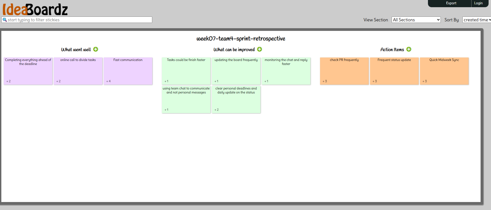

# Week 07 – Sprint Closeout

---

## ✅ Completed Tasks

| Task Name                                  | Creator         | Assignee         |
| ------------------------------------------ | --------------- | ---------------- |
| Feat 13 express init deger ahmet           | @degerahmet     | @degerahmet      |
| [FEATURE] ExpressJS Project Initialization | @degerahmet     | @degerahmet      |
| Create README file                         | AnastasiaTaucci | @degerahmet      |
| Software Development Plan                  | AnastasiaTaucci | @degerahmet      |
| Create GitHub Project Kanban               | AnastasiaTaucci | @AnastasiaTaucci |
| Submit Assignment                          | AnastasiaTaucci | @AnastasiaTaucci |
| Create app repo with branches              |                 | @joshuagnes      |

---

## 🕒 Unfinished Tasks

| Task Name                             | Creator         | Assignee    | Notes                            |
| ------------------------------------- | --------------- | ----------- | -------------------------------- |
| Configure Linters and Jest            | AnastasiaTaucci | @joshuagnes | Pending setup and config         |
| [FEATURE] Supabase Auth Middleware    | @degerahmet     | @degerahmet | Needs implementation and testing |
| [FEATURE] Create users Table          | @degerahmet     | @degerahmet | In Progress                      |
| [FEATURE] Supabase Client Integration | @degerahmet     | @degerahmet | In Progress                      |

---

## 🐛 Bugs / Blockers

_No major bugs reported, because no code writing this week
Potential blocker: Awaiting configuration of Supabase client for testing.
Potential blocker: Configure Linters and Jest.

---

## 🌟 Key Wins and Challenges

**Wins:**

- Project initialized with ExpressJS and README documentation.
- GitHub project board and development plan fully established.
- Successfully created foundational issues and PR for backend.
- Successfully learned how to do PR and approve them.

**Challenges:**

- No opportunity to meet in person in class and the long weekend --> was challenging to meet online

---

## ⏭️ Next Sprint Priorities

- Finalize Supabase client and user table integration.
- Complete backend table definitions (`flashcards`, `quiz_results`, etc.).
- Implement Supabase Auth Middleware.
- Configure Jest and ESLint with Husky for code quality.
- Start implementing flashcard creation logic (context).
- Homescreen, Login screen, Edit/Create deck screen. 
- Initial Application Structure, folder layout
